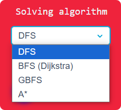
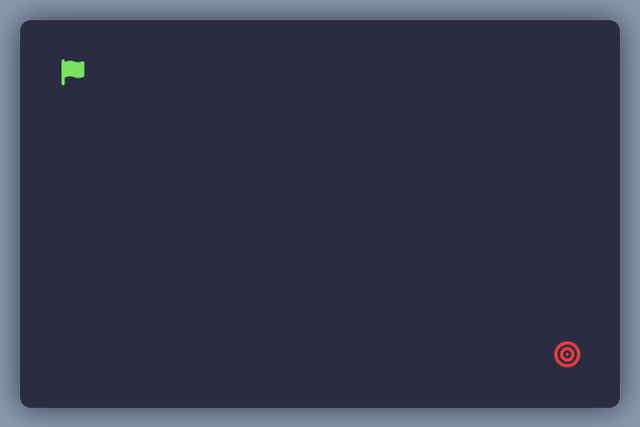
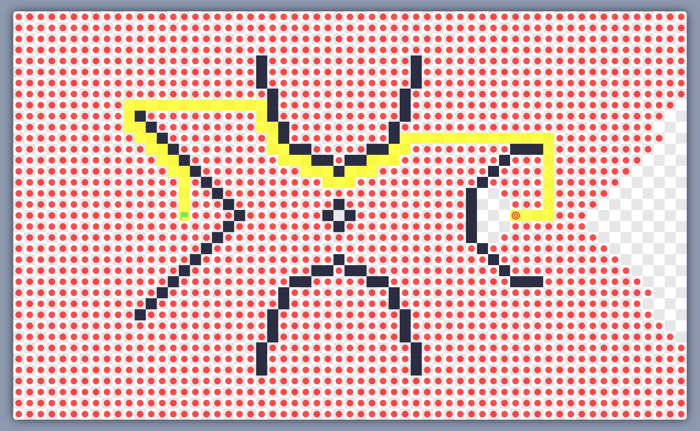
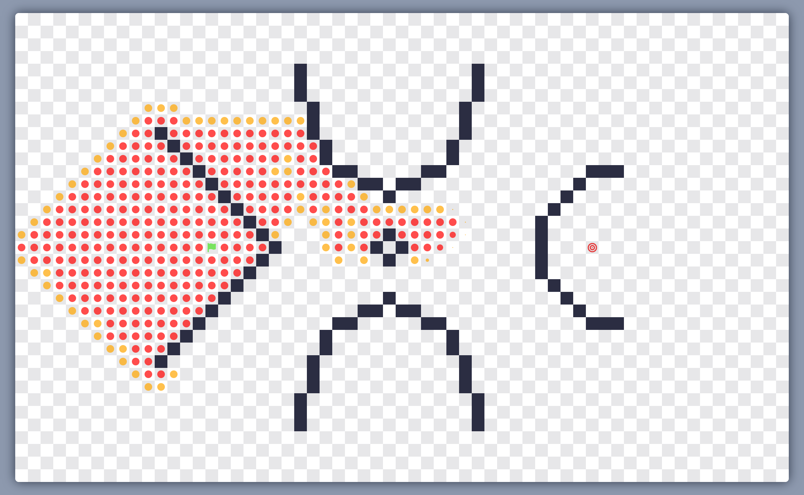

# 📍 Maze Maker Solver

Maze Maker Solver is a online web page that allows you to understant more easily how maze generating and pathfinding algorithms work. This project is an online visualisation of my previous python package project : **[Lapyrinth](https://github.com/Pietot/Lapyrinth)**

The web page is available : **[here](pietot.github.io/Maze-Maker-Solver/)**

	

## 📋 Summary

### 1. [Features](#1---features)
### 2. [Maze generation algorithms](#2---maze-generation-algorithms)
### 3. [Pathfinding algorithms](#3---pathfinding-algorithms)
### 4. [Improve the project](#4---improve-the-project)
### 5. [Credits](#5---credits)

## 1 - Features

- Choose a generation algorithm among 12 of them:

	

- Add/remove wall as you want:

	

- Find a path between the start and the end with 4 different algorithms:

	

- Set the speed of the animation

- Download the maze's array as a text file

## 2 - Maze generation algorithms

- **Kruskal's algorithm:**

	
	   

- **Randomized Depth-First Search:**

	
	   

- **Simplified Prim's Algorithm:**

	
	   

- **True Prim's Algorithm:**

	
	   

- **Hunt & Kill algorithm:**

	
	   

- **Eller's algorithm:**

	
	   

- **Iterative Division algorithm:**

	
	   

- **Binary Tree algorithm:**

	
	   

- **Sidewinder algorithm:**

	
	   

- **Aldous-Broder's algorithm:**

	
	   

- **Wilson's algorithm:**

	
	   

- **Origin Shift algorithm:**

	
	   

 

## 3 - Pathfinding algorithms

- **Depth-first Search** _(Fast but gives a long path most of the time)_ **:**

	
	

- **Breadth-First Search (Dijkstra)** _(Very slow but gives one of the shortest path)_ **:**

	
	

- **Greedy Best-First Search** _(Very fast but does not always give the shortest path)_ **:**

	
	

- **A\*** _(Slow but gives one of the shortest path)_ **:**

	
	

 

## 4 - Improve the project

If you like this project and/or want to help or improve it, you can:

- Create an issue if you find a bug or want to suggest a feature or any improvement (no matter how small it is).

- Create a pull request if you want to add a feature, fix a bug or improve the code.

- Contact me if you want to talk about the project or anything else (Discord: pietot).

> **Note**: If you want to be guided/helped, you already have a file named <a href="improvements.txt">improvements.txt</a> in the project directory, where you can see all the improvements that can be made.

# 5 - Credits

- **[Maze Solver](https://angeluriot.com/maze_solver/)**: The project was inspired by this website.
- **[Angel Uriot](https://angeluriot.com/maze_solver/)**: The original repository of the project.
- **[Lapyrinth](https://github.com/Pietot/Lapyrinth)**: My previous project which pushed me to create this web page.
